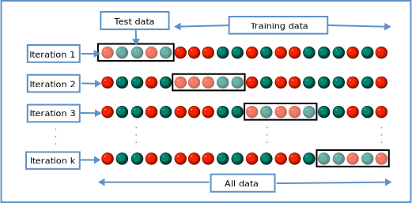
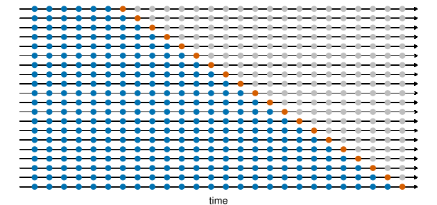
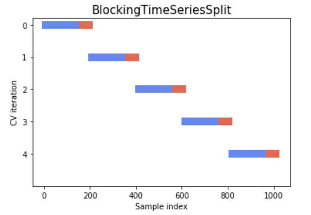

## Primero algo de contexto

En los ultimos dias he estado colaborando con un proyecto de etiquetado de entidades, tenemos un modelo tentativo y ahora requerimos validar dicho modelo con cross validation

## Validation Cruzada

En un principio el dataset es dividido en 3 partes. test, valijación y entrenamiento. Sin embargo esto deja el conjunto de entrenamiento un poco reducido y un conjunto de validación sesgado, que se comporte bien para alguna clase y con datos erroneos del performance del modelo.

Validacion cruzada o Cross validation en inglés. Es una tectnica para evaluar el comportamiento de un modelo aprovechando al maximo el dataset de entrenamiento y de validación.

1. Escojemos un numero k que indica el numero de iteraciones y la cantidad de diviciones del conjunto.
2. Estas subdiviciones tendran doble funcion, como entrenamiento y validacion.
3. Usamos uno de los fold como validación y los restantes como training
4. Iteramos usando una subdivicion distinata como testing cada vez.

### Problematica

El caso anterior funciona muy bien para modelos donde el resultado actual es independiente de los resultado anteriores o siguientes, sin embargo para modelos secuenciales que normalmente dependen de antriores estados resulta problematico dividir el dataset de esta manera ya que se pierde la información.

## Solucion

Para solventar este problema hay dos aproximaciones

### Validacion cruzada en series de timepo

1. Igual que la validacion cruzada escogemos un _k_
2. Escogemos los _n_ primeras diviciones para entrenamiento y la siguiente es la de validacion
3. Iteramos y avanzamos la divicion de validacion en las diviciones restantes.

De esta manera no se rompe la estructura secuancial de nuestro conjunto de datos. Sin embargo es notable que la ultima iteración tendra mas entrenamiento por tanto un mejor performace.

### Validación cruzada en bloques de series de tiempo

1. Escogemos $k$ diviciones
2. de cada una de estas diviciones seleccionamos una porcion para entrenamiento y otra para testign
